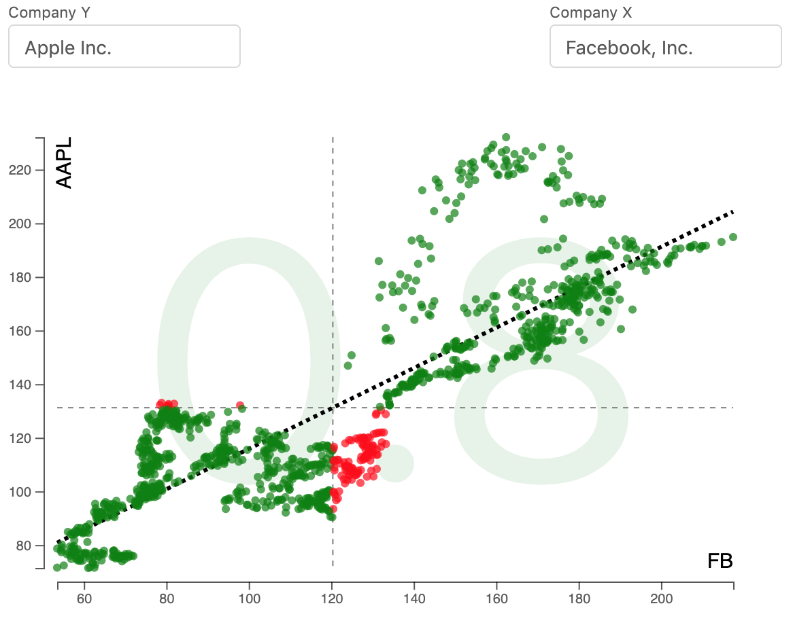

# Integration von zwei Micro-Frontends über Custom Elements am konkreten Beispiel
Im Folgenden wollen wir mit Code-Beispielen die Integration der Micro-Frontends von zwei Self-Contained-Systems über Custom Elements zeigen.
## Das Endprodukt
Die integrierte Anwendung sieht folgendermaßen aus:

* Element `<select-company></select-company>`: 
## Die Self-Contained-Systems

<!--stackedit_data:
eyJoaXN0b3J5IjpbLTE0NDc3MDY4NzUsMTkzNDQ1Nzg1NywyMD
UwMDM2MDY0LC0xMjgzNTM3MTAsLTg5MjIxMDkxXX0=
-->