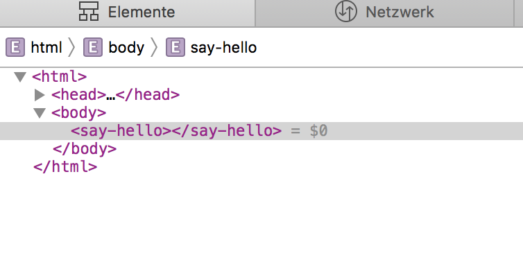

# UI und Microservices

Microservices haben sich im Backend Bereich in vielen Projekten als erfolgreiches Architektur-Pattern etabliert. Im Frontend-Bereich tut man sich trotz Konzepten wie Self-Contained-Systems ungleich schwerer. Einer der Gründe dürfte sein, dass es schwierig ist aus einer Vielzahl einzelner Frontends (Micro-Frontends) eine Lösung mit einem einheitlichen Look-And-Feel und einer konsistenten User-Experience herzustellen. Aus diesem Grund gibt es auch verschiedene Ansätze mit dieser Herausforderung umzugehen:

* Integration im Backend über vorhandene Mechanismen wie Server-Side-Includes
* Integration im Backend aber mit zusätzlicher Tool Unterstützung (https://www.mosaic9.org)
* Mono-Repo Ansatz (https://nx.dev)
* Integration im Frontend über Verlinkung (funktioniert am besten wenn jedes Micro-Frontend eine abgeschlossene Funktionalität aufweisen kann)
* Integration im Frontend über Web-Components

Wir haben uns für Web-Components als Werkzeug zur Integration unserer Micro-Frontends entschieden. Dabei verwenden wir die Web-Compnents API, um bestehende React-Kompoenten zu "wrappen". Die anderen Micro-Frontends benutzen dann die Web-Componente und wissen gar nicht, dass im Hintergrund React seine Dienste versieht. Dieser Ansatz hat folgende Vorteile:
* einfache Integration im Frontend
* schlanke API
* Web-Standard
* Abhängigkeit zum verwendeten Framework (hier React) bleibt auf das einzelne Micro-Frontend beschränkt.

Wo Licht ist, ist natürlich auch Schatten. Auf die vorhandenen Nachteile werden wir genauer eingehen, wenn es um die Details der Micro-Frontend Integration in unserem Projekt geht.

Bevor es an die Details unserer Verwendung vom Web-Components geht, lohnt es sich erst einmal zu klären, was Web-Components denn überhaupt sind. 

# Was sind Komponenten ?

1992 wurde Visual-Basic 2.0 von Microsoft der Öffentlichkeit präsentiert. Neben neuen Sprachfeatures für Objekt orientierte Programmierung, bot Visual-Basic  mit der VBX (Visual-Basic-Extension) Schnittstelle die Möglichkeit beliebige UI-Komponenten anderer Hersteller in eigenen Programme zu verwenden. 1995 zog dann Borland mit Delphi 1.0 und der Visual-Component Library nach. Java unternahm dann 1997 mit Swing und JavaBeans ebenfalls den Versuch an diese Erfolge anzuknüpfen. Mit allerdings eher mäßigem Erfolg, da sich im Gegensatz zu den Kompomenten-Modellen von Microsoft oder Borland eine eher begrenzte 3rd Party Unterstützung entwickelte. 

Die zunehmender Verbreitung des Web und Konzepten wie SPAs (Single-Page-Applications)sowie neuen Frameworks wie Angular oder React erlaubte es dann den Web-Entwicklern, die im Desktop-Umfeld bereits erfolgreiche Komponenten basierte Entwicklung für Web-Anwendungen zu verwenden.

Auch wenn diese Beispiele alle aus dem UI Umfeld stammen, muss es sich bei einer Komponente nicht unbedingt um eine UI-Komponente handeln. Grundlegende Voraussetzung für eine Komponente ist lediglich eine definierte Schnittstelle um verschiedene Komponenten verknüpfen und in eigene Anwendungen integrieren zu können.   

JavaScript Frameworks wie Angular oder React erfüllen zwar diese Voraussetzung, tun sich aber eher schwer damit Komponenten des anderen Frameworks zu verwenden.

Das ist umso erstaunlicher, da HTML seit langem zeigt, wie Komponenten definiert werden (über Tags) und wie die Schnittstelle aussehen muss (Verwendung von Attributen).

Aus diesem Grund wurde 2012 der erste Entwurf der Web-Components Spezifikation veröffentlicht, mit dem Ziel, die Verwendung von eigenen und wiederverwendbaren Tags zu standardisieren.

# Browser Support

Bevor es aber an die Details der Spezifikation geht, lohn sich ein kurzer Abstecher zu "Can I Use" (https://caniuse.com/#search=components) um zu prüfen, wie es um den Browser Support dieser Spezifikation bestellt ist. 

## Native

Benutzer von Firefox, Chrome und Safari  können sich freuen, da alle wichtigen Aspekte wie "Custom Elements", "Shadow Dom" und "HTML templates" unterstützt werden. Bei der Verwendung von Safari muss man lediglich mit einer kleinen Einschränkung leben, da nur  "Autonomous custom elements" aber keine "Customized built-in elements" verwendet werden können. Das bedeutet, dass in Safari zwar eigene Komponenten erstellt und verwendet werden können, die aber keine Möglichkeit bieten,   Eigenschaften von bestehenden HTML-Elementen (wie z.B. von einem Button) wiederzuverwenden (https://html.spec.whatwg.org/multipage/custom-elements.html#custom-elements-customized-builtin-example).

IE und Edge, die Browser von Microsoft, bieten zum derzeitigen Zeitpunkt keine Unterstützung für Web-Components. Für die Zukunft ist aber auch hier Besserung zu erwarten. Die zukünftige Version von Edge wird auf Chromium, der Open-Source Variante von Chrome, aufbauen und damit dann ebenfalls die Web-Components Spezifikation vollständig unterstützen.

## Polyfill

Für neuere Browser, außer Microsoft Edge, sieht die Web-Components Unterstützung  gut aus, für alle anderen gibt es ein Polyfill. Nähere Informationen zu Verwendung und Installation finden Sie unter https://www.webcomponents.org/polyfills. Dieses Poylfill rüstet sowohl die "Custom Elements" API als auch die "Shadow DOM" API für ältere Browser nach. Bei der Verwendung der "Shadow DOM" API ist allerdings Vorsicht geboten, das es negative Auswirkungen auf die Render-Performanz einer Seite haben kann. 

# Was sind Web components

Web-Components ist erst einmal nur eine Meta-Spezifikation für folgende Spezifikationen:

* Custom elements
* Shadow Dom
* ES Modules
* HTML Templates

Wenn ein Browser diese APIs gemäß der Spezifikationen implementiert, können Sie eigene Elemente definieren und dieser als neue Tags in einer HTML-Seite verwenden. Eine einfache Deklaration einer "Web-Component" sehen Sie in Beispiel 1.

*Beispiel 1 - hello.html*
```HTML
<html>
<head>
    <script>
    class SayHello extends HTMLElement {
        constructor() {
            super();
            let shadowRoot = this.attachShadow({mode: 'open'});
            shadowRoot.innerHTML = `<style> p {background: red}</style>
                                    <p>hello again</p>`;
        }
    }
    customElements.define('say-hello', SayHello);
    </script>
</head>
<body>
    <say-hello></say-hello>
     <p>I'm not red</p>
</body>
</html>

```

Laden Sie diese Seite in einem Browser, der die nötigen APIs unterstützt, wird eine Seite mit dem Text "hello again" angezeigt. Die Erklärungen zu diesem dieses Beispiel finden Sie in den folgenden Abschnitten über die einzelnen Bestandteile der Web-Components Spezifikation.

# Die APIs

## Custom elements

*Bild 1 - Dom mit Web-Component*



Jeder Web-Entwickler der eins der bekannten Frameworks wie Angular oder React verwendet hat weiß, dass die sinnvolle Aufteilung einer Applikation in Komponenten die Entwicklung und Weiterentwicklung erheblich vereinfacht. Leider geht diese Struktur verloren, sobald die Inhalte einer Angular oder React Komponente in den Dom-Tree des Browsers eingefügt werden. Aus den sorgsam aufgebauten Komponenten bleibt dann nur noch eine Sammlung von HTML-Tags übrig, die, ohne den Einsatz spezieller Werkzeuge, insbesondere die Fehlersuche erschweren. Diese Komponenten-Struktur, auch im Dom-Tree des Browsers sichtbar zu machen, ist Aufgabe der "Custom elements" Spezifikation. In *Bild 1* sehen Sie wie die in *Beispiel 1* deklarierte Komponente als Tag *say-hello* im Inspector des Safari-Browsers angezeigt wird. Um dieses Verhalten zu erreichen sind zwei Dinge nötig:
* unsere Klasse muß von der Klasse *HTMLElement* erben
* und über den Aufruf von `customElements.define` wird unserer Klasse ein HTML-Tag zugeordnet.

Das der Name unseres Tags einen Bindestricht enthält, ist dabei kein Zufall, sondern eine durch die Spezifikation vorgegeben Namenskonvention. Dadurch wird eine Namenskollision mit vorhandenen oder zukünftigen HTML-Tags vermieden. 

## Shadow Dom

Die Kapselung von HTML Code in einer Komponente löst aber nur ein Teil des Problems. Neben HTML gibt es ja auch noch CSS. Ursprünglich arbeiten CSS Selektoren über alle Elemente einer Seite. Das würde bedeuten, das wir mit den Styling-Regeln unsere Komponente das umgebende Layout zerstören könnten. Das widerspricht ganz klar dem Konzept einer Komponente, unabhängig und wiederverwendbar zu sein. Aus diesem Grund wurde die "Shadow Dom" Spezifikation ins Leben gerufen. Diese Spezifikation erfüllt 2 Aufgaben:

* Style Informationen bleiben innerhalb der Komponente
* die interne Implementierung der Komponente ist nicht sichtbar

Die Verwendung des "Shadow Dom" sehen Sie in Beispiel 1 bei der Verwendung des `this.attachShadow({mode: 'open'})` Aufrufs. Dieser Aufruf erzeugt für unsere Komponente einen eigenen lokalen "Dom-Tree" und beschränkt dadurch den Geltungsbereich der CSS-Regel. Das `p` Tag nach unserem `<say-hello>` ist daher nicht von der Änderung der Hintergrund Farbe betroffen. 

Der Parameter `{mode: 'open'}` sagt der API übrigens, daß wir auf das Verstecken der Implementierungsdetails verzichten.

Die "Shadow DOM" Spezifikation ist neben der "Custom elements" Spezifikation der wichtigste Bestandteil der "Web components" Spezifikation. Leider mussten wir im Laufe unseres Projekts feststellen, das sie für unser Projekt mehr Problem verursacht als löst. Das hat folgende Gründe:

* React Events und "Shadow dom" vertragen sich nicht, da Reacts Event System keine Events von "Custom elements" empfangen kann. Am Anfang haben wir das durch eine von uns gepatchte React Version umgangen, was es aber schwierig machte auf neue React Versionen zu migrieren.
* Um ein einheitliches Look-And-Feel über alle Micro-Frontends zu gewährleisten hatten wir uns sowieso für ein zentrales Stylesheet entschieden.

Aus diesen Gründen verzichten wir aktuell auf die Verwendung des "Shadow Dom".


React ist übrigens nicht das einzige Framework, das Probleme im Umgang mit Web-Components hat. Eine aktuelle Übersicht zum Stand der Kompatibilität von verschiedenen Frameworks und Web-Components finden Sie unter https://custom-elements-everywhere.com.

## ES Modules

Die "ES Module" Spezifikation definiert ein API die es erlaubt JavaScript Dokumente in andere Java-Skript Dokumente einzubinden. Ursprünglich wurde über die "HTML Import" Spezifikation versucht diese Verhalten zu spezifizieren. Diese Spezifikation wurde aber von den Entwicklungen im JavaScript Umfeld überholt. Statt eigene Konzepte zu definieren  wie es die "HTML Import" Spezifikation versuchte bedient sich die "ES Module" Spezifikation den aus der JavaScript Entwicklung vertrauten Konzepten. Im Beispiel 4 sehen Sie ein Beispiel für die Verwendung der "ES Modules" API. Für das Ausführen dieses Beispiels genügt es nicht mehr, die Datei import.html direkt in einem Browser zu öffnen. Am einfachsten ist es einen lokalen Webserver mit dem SimpleHTTPServer Package von Python zu starten:

```
python -m SimpleHTTPServer 8000
```

Die Seite können Sie dann über die URL http://localhost:8000/example4.html laden und der Text "hello again" erscheint dann wie erwartet im Browser Fenster.


*Beispiel 4 - say-hello.js*
```JavaScript
export class SayHello extends HTMLelement {
    constructor() {
        super();
        let shadowRoot = this.attachShadow({mode: 'open'});
        shadowRoot.innerHTML = `<p>hello again</p>`;
    }
}

customElements.define('say-hello', SayHello);
```
*Beispiel 4 - import.html*
```HTML
<html>
    <head>
        <script type="module">
            import {SayHello} from '/say-hello.js';
        </script>
    </head>
    <body>
        <say-hello></say-hello>
    </body>
</html>

```

## HTML Templates

Die Spezifikation für "HTML Templates" beschäftigt sich mit der Fragestellung wie HTML-Code Fragmente von HTML definiert und wiederverwendet werden können. "HTML Templates" sind daher auch ohne Web-Components verwendbar und Web-Components können auch ohne "HTML Templates" entwickelt werden. Die Verwendung von Templates erleichtert aber die Entwicklung von Web-Components und erlaubt die klare Trennung von Code und Markup.

In Beispiel 5 sehen Sie wie "HTML Templates" verwendet werden. Das Beispiel zeigt darüberhinaus die Verwendung von "slots". Sie erlauben HTML-Fragmente anzugeben, die den entsprechend benannten Part im Template ersetzen. Bei der Ausführung von Beispiel 5 wird daher 
```HTML
<slot name="and-more"></slot>
``` 
durch 

```HTML
<div slot="and-more">
    ... and more
</div>
```

ersetzt.

*Beispiel 5 - import.html*
```HTML
<html>
<head>

 <template id="my-text">
        <p>hello again</p>
        <p style="color: red"><slot name="and-more"></slot></p>
 </template>

  <script>

  class SayHello extends HTMLElement {
    constructor() {
      super();
      const template = document.getElementById('my-text');
      const templateContent = template.content;
      this.attachShadow({mode: 'open'})
        .appendChild(templateContent.cloneNode(true)) 
    }
  }
  customElements.define('say-hello', SayHello);
  </script>

</head>

<body>
  <say-hello>
      <div slot="and-more">
          ... and more
      </div>
  </say-hello>
</body>

</html>
```

# Aus dem Leben einer Komponente

Wie man eine Komponente definiert und verwendet haben Sie in den vorherigen Beispielen gesehen. In Beispiel 6, sehen Sie was man darüber hinaus mit Web-Components noch so alles anstellen kann. Dazu gehört:
* die Verwendung von Attributen, um Daten an die Komponente zu übertragen
* die Verwendung eines Listeners, um auf Ereignisse zu reagieren
* das Überschreiben von Methoden `observedAttributes` und `connectedCallback`, um die Komponente an die eigenen Bedürfnisse anzupassen.

Beim näheren Betrachten dieses Beispiels wird deutlich, dass die "Custom elements" API alles nötige zur Verfügung stellt um eine wiederverwendbare Komponente zu erstellen. Allerdings ist dafür recht viel Code nötig und so elegant wie man es von React oder Angular gewohnt ist, sieht der Code auch nicht aus. 


*Beispiel 6 - listener.html*
```HTML
<html>
<head>
    <script>
    class SayHello extends HTMLElement {

        static get observedAttributes() {
            return ['text'];
        }

        get value() {
         return this.getAttribute('text');
        }

        set value(newValue) {
            this.setAttribute('text', newValue);
        }

        attributeChangedCallback(name, oldValue, newValue) {
           this.text.innerText = this.value;
        }
     
        connectedCallback() {
            this.button.addEventListener('click', () => this.value = 'changed');
        }

        constructor() {
            super();
            let shadowRoot = this.attachShadow({mode: 'open'});
            shadowRoot.innerHTML = `<p><span id="text"/>${this.value}</p>
                                    <button>click</button>`;
            this.button = this.shadowRoot.querySelector('button');
            this.text = this.shadowRoot.querySelector('span#text');
        }
    }
    customElements.define('say-hello', SayHello);
    </script>
</head>
<body>
    <say-hello text="another hello"></say-hello>
</body>
</html>
```

## Web-Components aber einfach

Die direkte Benutzung der Web-Components API ist für kleinere Aufgaben ausreichend, für umfangreichre Projekte jedoch zu rudimentär. Au diesem Grund existieren mittlerweile einige Frameworks und Libraries um genau an diesem Punkt Abhilfe zu schaffen. Zu nennen ist vor allem stencil.js, von den Ionic Machern. Dieses Tool stellt einen Compiler zur Verfügung der den stencil.js Code direkt in die passenden Web-Components API Aufrufe übersetzt. Eine andere  Alternative ist LitElement (https://lit-element.polymer-project.org) von Google oder SkateJS (https://skatejs.netlify.com).

lorem ipsum

## Attribute

lorem ipsum

## Listener

lorem ipsum

# Web components in der freien Wildbahn

lorem ipsum

## Polymer

lorem ipsum

## LitElement

lorem ipsum

## stencil.js

lorem ipsum

## vaadin-core

lorem ipsum

## Angular components

lorem ipsum

## React

lorem ipsum


